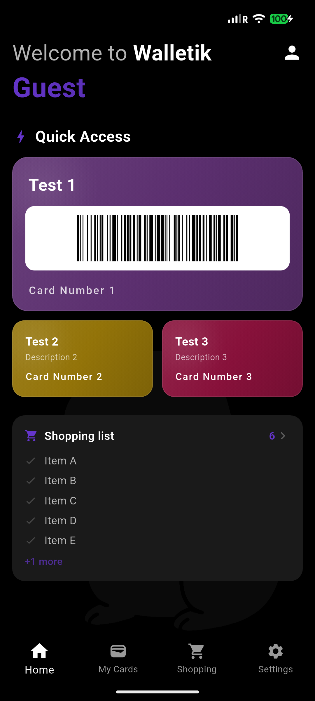
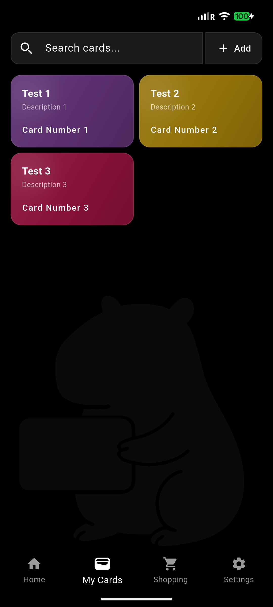
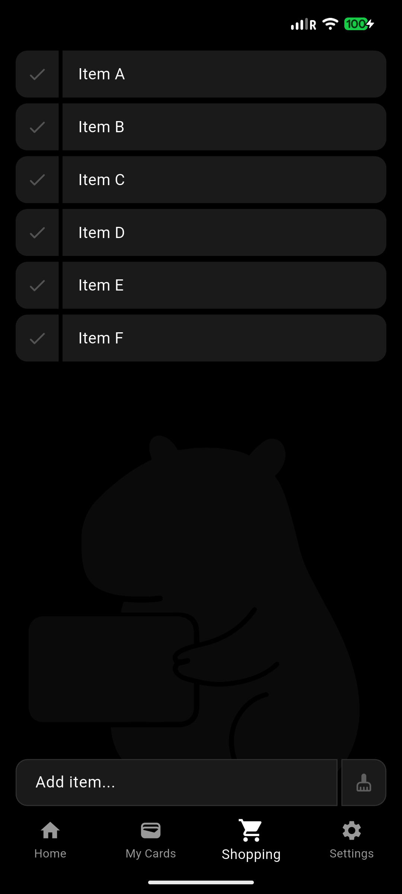
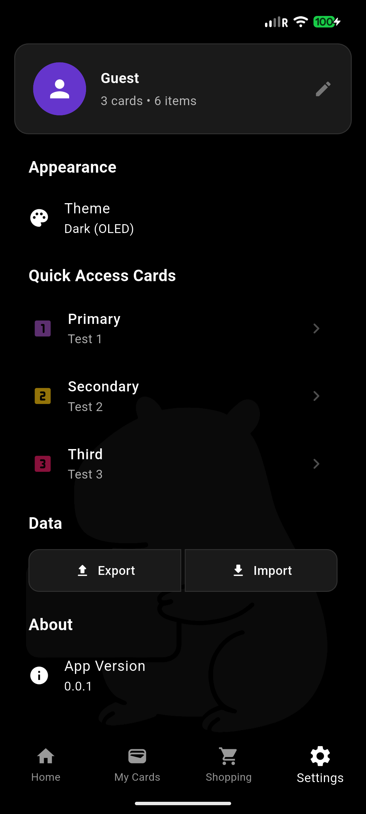

# Walletik

A loyalty card wallet & shopping list app built with Flutter. Store all your loyalty cards digitally, scan barcodes at checkout, and manage your shopping list — all in one place.

[](https://flutter.dev)
[](https://dart.dev)
[](LICENSE)
[]()
[]()

## Screenshots

<p align="center">
  
  
  
  
</p>

## Features

### Loyalty Cards
- **Barcode scanning** — scan any barcode/QR code with your camera
- **Manual entry** — add cards by typing the number
- **Quick access** — set up to 3 cards on the home screen for instant use
- **Multiple formats** — Code128, EAN-13, QR Code, and more
- **Card colors** — choose from 12 colors with gradient backgrounds
- **Reorderable grid** — drag and drop to organize your cards

### Shopping List
- **Quick add** — type and press Enter, keyboard stays open for rapid entry
- **Tap to check off** — mark items as done with animated feedback
- **Swipe gestures** — right to edit, left to delete
- **Inline undo** — accidentally deleted? 3-second undo right in the list
- **Reorderable** — long press to drag items into your preferred order
- **Quantity & edit** — bottom sheet editor with quantity stepper

### App
- **4 themes** — Light, Dark, OLED Black, Dark Purple
- **Data export/import** — JSON backup via system share sheet
- **Haptic feedback** — subtle vibrations on interactions
- **Onboarding** — guided setup when you first open the app
- **Home dashboard** — quick access cards + mini shopping list preview

## Tech Stack

<p>
  
  
  
  
</p>

| Layer | Technology |
|---|---|
| **Framework** | Flutter 3.9+ / Dart 3.9+ |
| **State Management** | Provider (ChangeNotifier) |
| **Storage** | SharedPreferences (JSON) |
| **Architecture** | Repository pattern |
| **Barcode** | `barcode` + `flutter_svg` for rendering, `mobile_scanner` for camera |
| **Export** | `share_plus` + `file_picker` + `path_provider` |

## Architecture

```
lib/
├── main.dart                    # App entry, navigation, Provider setup
├── models/
│   ├── loyalty_card.dart        # Card model with JSON serialization
│   └── shopping_item.dart       # Shopping item model
├── providers/
│   ├── card_provider.dart       # Card state management
│   ├── shopping_provider.dart   # Shopping list state management
│   └── theme_provider.dart      # Theme switching (4 themes)
├── repositories/
│   ├── card_repository.dart     # Abstract card repository
│   ├── card_repository_impl.dart
│   ├── shopping_repository.dart # Abstract shopping repository
│   └── shopping_repository_impl.dart
├── services/
│   ├── card_storage.dart        # SharedPreferences card storage
│   ├── shopping_list_storage.dart
│   └── data_export_service.dart # JSON export/import
├── screens/
│   ├── home_screen.dart         # Dashboard with quick access + shopping preview
│   ├── cards_screen.dart        # Reorderable card grid
│   ├── add_card_screen.dart     # Add/edit card bottom sheet
│   ├── shopping_list_screen.dart
│   ├── settings_screen.dart     # Themes, quick access, data, about
│   └── barcode_scanner_screen.dart
├── widgets/
│   ├── loyalty_card.dart        # Card widget with gradient + light reflection
│   ├── card_detail_modal.dart   # Full card view with barcode
│   └── background_logo.dart     # Background watermark
└── utils/
    ├── constants.dart           # Colors, config
    ├── color_utils.dart         # Hex ↔ Color conversion
    ├── barcode_utils.dart       # Barcode SVG generation
    └── route_transitions.dart   # Page transition animations
```

## Getting Started

### Prerequisites
- Flutter SDK 3.9+
- Android Studio / VS Code
- Android device or emulator

### Installation

```bash
git clone https://github.com/unknownMarko/walletik.git
cd walletik
flutter pub get
flutter run
```

## Testing

```bash
flutter test
```

45 tests covering:
- **Models** — JSON serialization, equality, copyWith, edge cases
- **Providers** — add, delete, toggle, reorder, clear operations
- **Utils** — color parsing, fallbacks

## License

This project is licensed under the MIT License — see the [LICENSE](LICENSE) file for details.
